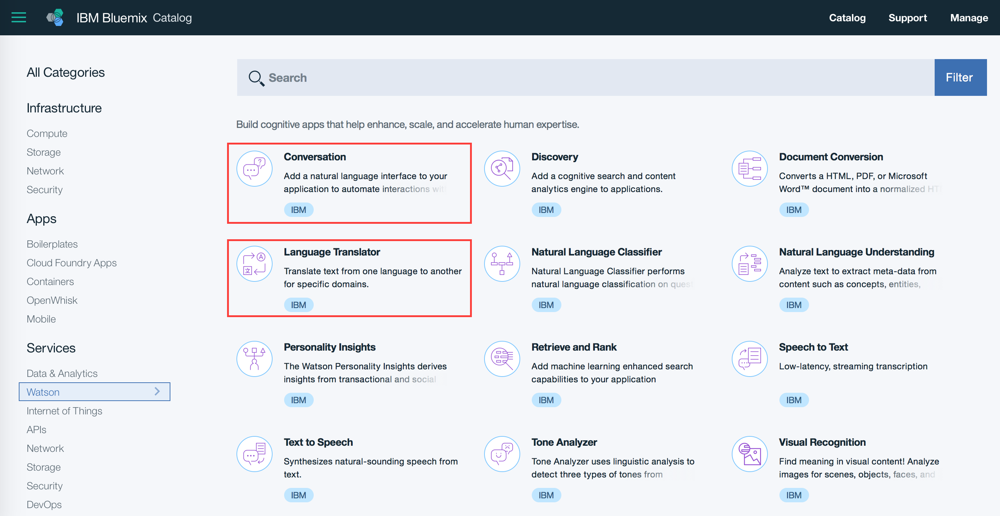
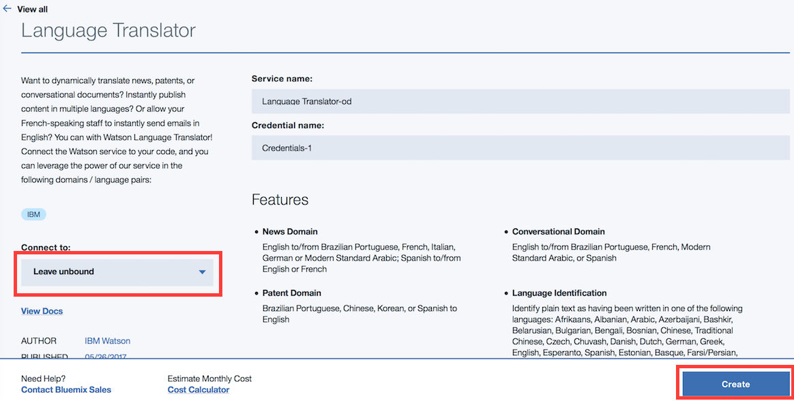
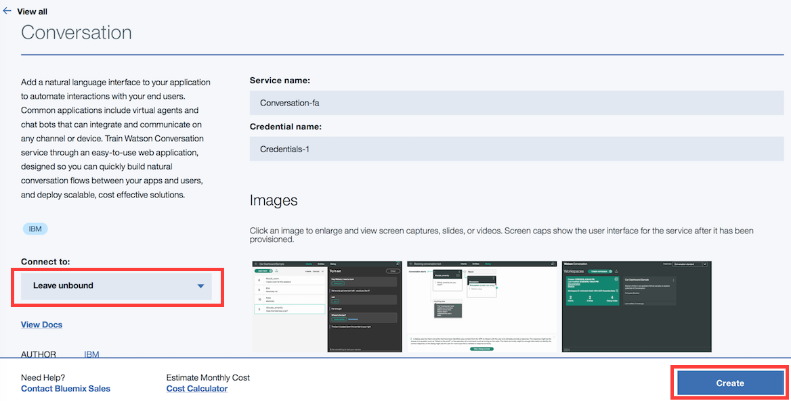
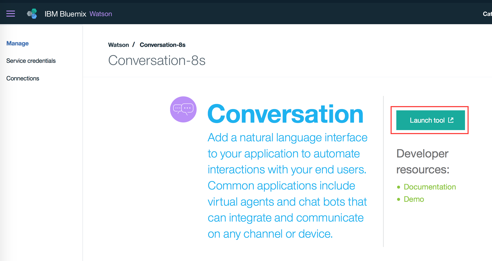
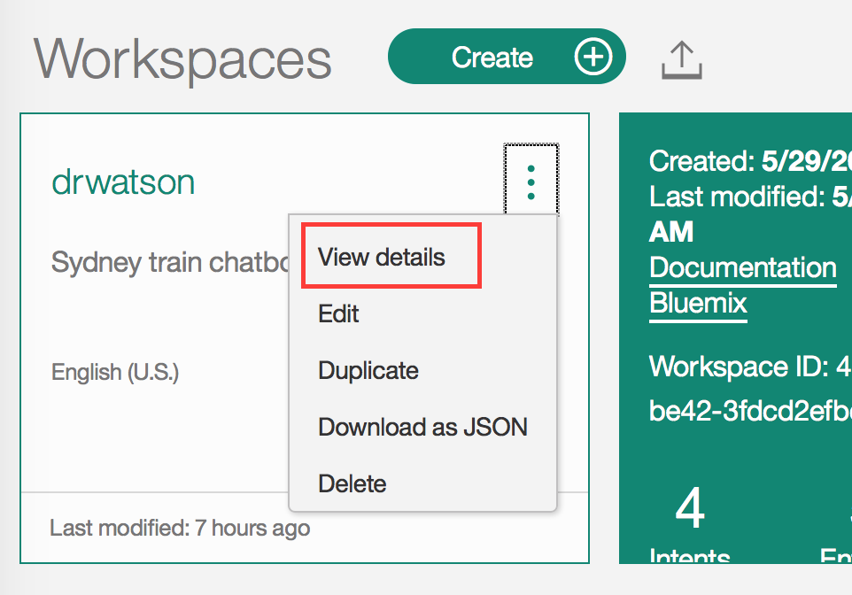

# Multi-language chatbot
The Bluemix catalogue provides many Watson service APIs that you can use to enhance your chatbot. In this demo, I'll use the Language Translator API and the Watson Conversation language to create a chatbot that support multi-languages. The chatbot automatically detects the language used in the conversation and responds accordingly. This demo is based on the Watson Developer Cloud's [botkit-middleware](https://github.com/watson-developer-cloud/botkit-middleware), which provides interfaces for Slack, Facebook, and Twilio clients.

## Bot Setup
You'll need to acquire a SLACK token (Bot User OAuth Access Token) to connect to a SLACK bot user. If you haven't got one, you can follow the following [Botkit's instructions](https://github.com/howdyai/botkit) to create one.

Follow [botkit-middleware](https://github.com/watson-developer-cloud/botkit-middleware) to understand how botkit works on Bluemix.

You'll need to have a Bluemix account to create an instance of Language Translator and Watson Conversation service and deploy the sample app. If you don't have an account, you can register a free trial account [here](https://console.ng.bluemix.net/registration/)

Locate the Language Translator and Watson Conversation service from the Bluemix catalogue


From the Bluemix catalogue, create a Translator service and leave it unbound


Create a Watson Conversation service, and leave it unbound


Now, we're going to 'train' the Watson Conversation service some English and French. From the Service dashboard, select the Conversation service that has just been created and Launch the training tool


From the Conversation tool, import the 'pre-trained' [English](https://raw.githubusercontent.com/andonguyen/watson-multilanguage-botkit/master/sample-code/drwatson.json) and [French](https://raw.githubusercontent.com/andonguyen/watson-multilanguage-botkit/master/sample-code/drwatson_fr.json) workspaces.

View details of each workspace and note down the Workspace ID. The Workspace IDs are required for the application to connect to the Watson Conversation service


If you'd like to learn more about creating your own conversation, you can check out the service's documentation [here](https://www.ibm.com/watson/developercloud/doc/conversation/index.html)

The next step is to link these services to the [sample code](https://github.com/andonguyen/watson-multilanguage-botkit/tree/master/sample-code). You'll need to modify the manifest.yml. The manifest.yml file maintains the configuration parameters required to deploy a CF application to Bluemix.

Update the service list with the name of the created Translator and Conversation services.

Also, update the conversation Workspace IDs and the SLACK token

```
applications:
- path: .
  memory: 256M
  instances: 1
  domain: mybluemix.net
  name: multilanguage-chatbot
  host: multilanguage-chatbot
  buildpack: sdk-for-nodejs
  disk_quota: 1024M
services:
- Conversation-xx
- Language Translator-xx
env:
  CONVERSATION_WORKSPACE_ID: default conversation workspace ID
  CONVERSATION_WORKSPACE_ID_fr: conversation workspace ID for French language
  SLACK_TOKEN: Bot User OAuth Access Token
```

Push the application to Bluemix. From the sample code directory (where the manifest.yml is located),

```
cf api https://api.ng.bluemix.net
cf login -u YOUR_BLUEMIX_USERNAME
cf push
```

You can start now chatting with your SLACK chatbot in either English or French. 
