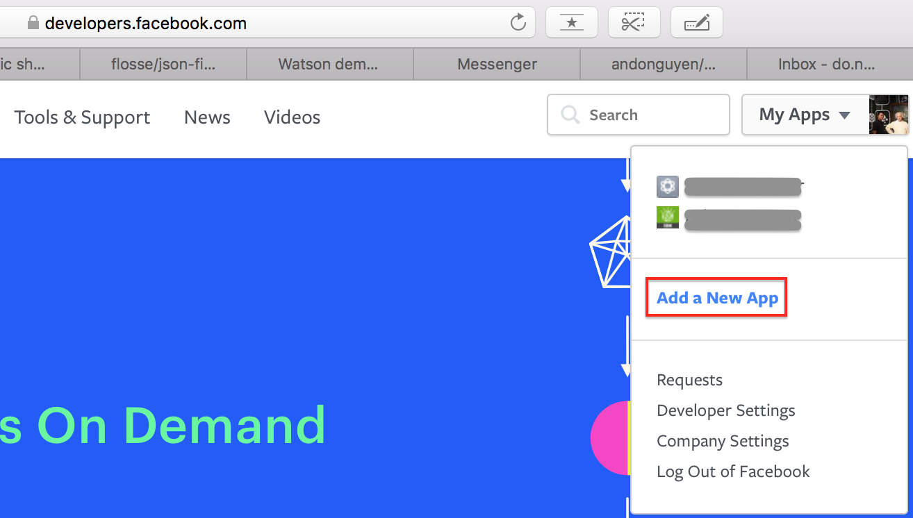
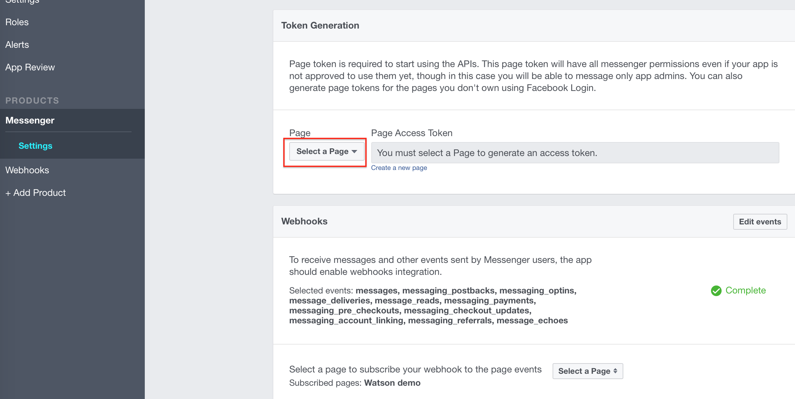
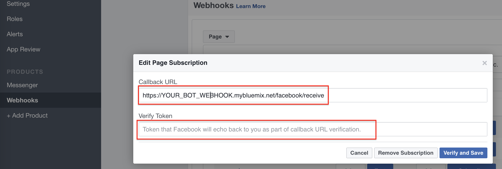

# Multi-language chatbot
The Bluemix catalogue provides many Watson service APIs that you can use to enhance your chatbot. In this demo, I'll use the Language Translator API and the Watson Conversation language to create a chatbot that support multi-languages. The chatbot automatically detects the language used in the conversation and responds accordingly. This demo is based on the Watson Developer Cloud's [botkit-middleware](https://github.com/watson-developer-cloud/botkit-middleware), which provides interfaces for Slack, Facebook, and Twilio clients.

## Bluemix Watson service Setup
You'll need to create a Facebook Fan page and acquire a FB access code from https://developers.facebook.com

Follow [botkit-middleware](https://github.com/watson-developer-cloud/botkit-middleware) to understand how botkit works on Bluemix.

You'll need to have a Bluemix account to create an instance of Language Translator and Watson Conversation service and deploy the sample app. If you don't have an account, you can register a free trial account [here](https://console.ng.bluemix.net/registration/)

Locate the Language Translator and Watson Conversation service from the Bluemix catalogue


From the Bluemix catalogue, create a Translator service and leave it unbound


Create a Watson Conversation service, and leave it unbound


Now, we're going to 'train' the Watson Conversation service some English and French. From the Service dashboard, select the Conversation service that has just been created and Launch the training tool


From the Conversation tool, import the 'pre-trained' [English](https://raw.githubusercontent.com/andonguyen/watson-multilanguage-botkit/master/sample-code/drwatson.json) and [French](https://raw.githubusercontent.com/andonguyen/watson-multilanguage-botkit/master/sample-code/drwatson_fr.json) workspaces.

View details of each workspace and note down the Workspace ID. The Workspace IDs are required for the application to connect to the Watson Conversation service


If you'd like to learn more about creating your own conversation, you can check out the service's documentation [here](https://www.ibm.com/watson/developercloud/doc/conversation/index.html)

## Facebook app setup

To create a Facebook access token, you first need to create a FB app that associates with the FB page you created. Go to [FB developers](https://developers.facebook.com) and create an app (top right menu)


Acquire the FB token by create a messenger app inside the FB app you created and select a FB page to generate its access token


The next step is to deploy the [FB webhook](https://github.com/andonguyen/watson-facebook-botkit/tree/master/sample-code) onto Bluemix and link it to the FB app. You'll need to update the manifest.yml used to maintain the configuration parameters required to deploy a CF application to Bluemix.

Update the service list with the name of the created Translator and Conversation services.

Also, update the conversation Workspace IDs and the Facebook access token and verify token. The Facebook verify token can be any random string that Facebook will use to connect to your webhook.


```
applications:
- path: .
  memory: 256M
  instances: 1
  domain: mybluemix.net
  name: YOUR_FB_WEBHOOK_HOSTNAME
  host: YOUR_FB_WEBHOOK_HOSTNAME
  disk_quota: 1024M
services:
- Conversation-star
- Language Translator-xxx
env:
  CONVERSATION_WORKSPACE_ID: Default Conversation workspace ID (English)
  CONVERSATION_WORKSPACE_ID_cn: Conversation workspace ID for Chinese
  FB_ACCESS_TOKEN: Your Facebook app access token
  FB_VERIFY_TOKEN: Your verify token for Facebook web hook
```

Push the application to Bluemix. From the sample code directory (where the manifest.yml is located),

```
cf api https://api.ng.bluemix.net
cf login -u YOUR_BLUEMIX_USERNAME
cf push
```

When you finish the deployment and FB webhook is started, the webhook URL will be YOUR_FB_WEBHOOK_HOSTNAME.mybluemix.net
Go back to the FB app (developers.facebook.com) and create a webhook connection and subscribe it to the messages, messaging_postbacks, messaging_optins, messaging_referals, messaging_deliveries, messaging_read and messaging_echoes, then click subscribe to link it to the deployed webhook on Bluemix


On the webhook subscription popup, enter your Bluemix webhook URL and the generated VERIFY token


That's it! you can start chatting with the FB bot (the FB page) using FB messenger
